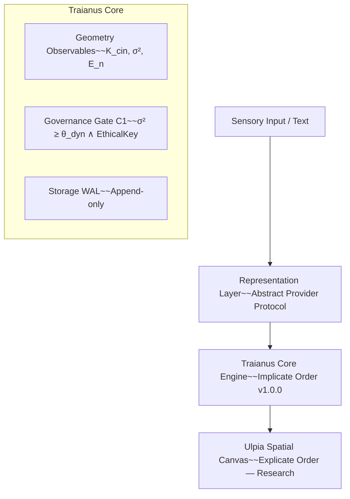

# Deterministic Spatial Control Plane & Local-First Research Substrate

> Decoupling vector representation systems from state management over $v \in \mathbb{R}^d$.

[](https://github.com/AlexusPacicus/Traianus/actions/workflows/ci.yml)
[](pyproject.toml)
[](LICENSE)
[](pyproject.toml)

---

## ⚡ Quickstart & Hermetic Verification

Traianus is frozen in `v1.0.0` with a hermetic, offline-isolated test suite. You can run the deterministic core and verify system invariants locally:

```bash
# 1. Clone the repository
git clone https://github.com/AlexusPacicus/Traianus.git
cd Traianus

# 2. Install in editable mode (Python 3.11, pinned in pyproject.toml)
python -m venv .venv
source .venv/bin/activate
pip install -e .
pip install -e ".[test]"

# 3. Bootstrap the local substrate scaffold (8D geodetic basis)
traianus-bootstrap

# 4. Run the complete hermetic test suite (Unit, Integration, Security & Representation)
pytest
```

The default run (`pytest`) executes the offline hermetic suite (`-m "not model"`). The E2E partition that requires the cached `all-MiniLM-L6-v2` model runs with `pytest tests/ -m "model"`.

### Serve (localhost only)

```bash
TRAIANUS_TOKEN=your-secret uvicorn traianus.app:app --host 127.0.0.1 --port 8000
```

The FastAPI server binds exclusively to loopback `127.0.0.1` — no external network exposure. `TRAIANUS_TOKEN` is mandatory for the protected endpoints (`/ingesta`, `/ingesta/vector`, `/nodos/{node_id}/consolidar`, `/mutate/{new_symbol}`, `/relations`, `/telemetry`); unauthenticated requests respond with 401. `GET /nodos` is public.

| Variable | Required | Type | Default | Description |
| :--- | :---: | :--- | :--- | :--- |
| `TRAIANUS_TOKEN` | Yes | string | — | Operator token for protected endpoints. |
| `TRAIANUS_EPSILON_EDGE` | No | float | `0.8` | Distance threshold ε for deterministic adjacency (‖vᵢ − vⱼ‖₂ ≤ ε). |

---

## 🏗️ Core Architecture: Decoupling Representation from State

Current software architectures conflate representation (mapping reality into embeddings via encoders or cloud APIs) with state management. Traianus decouples these responsibilities via abstract provider protocols, providing a white-box, deterministic control plane over local state.

```text
[ Sensory Input / Text ]
          |
          v
[ Representation Layer ]  ---> Abstract Provider Protocol (SentenceTransformers / Mock)
          |
          v  (Strict Boundary Enforcement)
[ Traianus Core Engine ]  ---> Deterministic Geometry & State Management (v ∈ ℝᵈ)   (Implicate Order — v1.0.0)
          |
          v
[ Ulpia Spatial Canvas ]  ---> Projection Layer
```



**Traianus is the implicate order** — the backend engine owning deterministic state transitions over coordinate vectors. **Ulpia is the explicate order** — the read-only projection layer that observes state ($O_n = P_\theta(S_n)$, ADR-022/024). Ulpia is declared RESEARCH / FUTURE ROADMAP and has no code in `traianus/`.

This separation addresses the **Representation-State Coupling Problem** and guarantees three core properties:

- **Deterministic state engine** — spatial state transitions $S_{n+1} = f(S_n, \mathbf{v}_n)$ governed deterministically over $L_2$-normalized coordinate vectors $\mathbf{v} \in \mathbb{R}^d$.
- **State reproducibility** — identical vector sequences, initial state, and execution semantics yield identical transitions.
- **Offline sovereignty** — hermetic execution offline (`HF_HUB_OFFLINE=1`, `local_files_only=True`) with zero cloud runtime dependencies.

### System Boundaries & Non-Goals

* **Not a Large Language Model:** performs zero probabilistic text completion, token generation, or prompt processing.
* **Not a Standard Vector Database:** does not index static embeddings for top-k similarity retrieval; it is an active spatial state controller.
* **Not a Graph Database:** avoids manual triple extraction or static rigid schemas.
* **Not an Execution Agent Framework:** executes zero autonomous external tools, network API calls, or unmonitored background tasks.
* **Not a User Interface Framework:** contains zero rendering or layout code; inspection layers are optional read-only observation clients.

### Modality Specialization (EAS-01)

* **Continuous signals & physical telemetry:** governed natively by continuous spectral projection variance (σ²) in `traianus/geometry/observables.py` (C1 threshold calibration, self-projections excluded).
* **Natural language text (RefApp-01):** governed via Normalized Compression Distance (NCD) coupling or Human-In-The-Loop (HITL) validation — demonstrating graded resistance to keyword injection (zlib AUC 0.953, bz2/lzma AUC 0.922–0.933).

### Status

Core/Control Plane **v1.0.0 (IMPLEMENTED)**. Work Packages WP1–WP4 (including Persistent Homology) and the Ulpia observation client remain **RESEARCH / FUTURE ROADMAP**. See [IMPLEMENTATION_STATUS.md](./IMPLEMENTATION_STATUS.md) and [docs/STATUS.md](./docs/STATUS.md).

---

## 📂 Repository Layout

```text
Traianus/
├── traianus/                # Core Python Package
│   ├── core.py              # Pure geometry & dual-key gate kernel (re-export shim)
│   ├── storage.py           # Hardened local vector storage (SQLite WAL, append-only)
│   ├── app.py               # Application entrypoint (loopback-bound HTTP server)
│   ├── bootstrap.py         # Bootstrap geodesy scaffold (8D basis, PROSTHETIC_NSM_V1)
│   ├── observability.py     # Structured logging & telemetry (structlog, request_id)
│   ├── geometry/            # Observables & spatial projections
│   ├── governance/          # System gates & invariants
│   ├── representation/      # Encoder protocols & sentence-transformers
│   └── security/            # Boundary validators & schema security
├── tests/                   # Hermetic Test Harness
│   ├── integration/         # Pressure, relief & vector ingestion tests
│   ├── representation/      # Provider independence tests
│   ├── security/            # Boundary & permission audits
│   └── unit/                # Core substrate invariant tests
├── tools/                   # Audits, MCP servers & simulation experiments
└── docs/                    # Architectural specs, audits & status ledger
```

---

## 📖 Deep-Dive Documentation

For thorough theoretical, topological, and architectural specifications, consult the `docs/` directory:

* **🏛️ System Architecture:** [docs/architecture/ARCHITECTURE.md](./docs/architecture/ARCHITECTURE.md) — complete component contracts and dataflow design.
* **🔒 PoC Freeze Contract:** [docs/architecture/contracts/POC_FREEZE_v1.md](./docs/architecture/contracts/POC_FREEZE_v1.md) — v1.0.0 invariants, reproducibility guarantees, and version sealing rules.
* **🛡️ Security & Boundary Audit:** [docs/audit/AUDIT.md](./docs/audit/AUDIT.md) — invariant verification and hermetic boundary guarantees.
* **📜 Foundation Manuscripts (SUA POTESTAS, Tomo 0):** declared RESEARCH / FUTURE ROADMAP — experimental reproduction in `tools/experiments/exp_manifesto_tomo0.py`.
* **Master Index:** [docs/INDEX.md](./docs/INDEX.md) — unified traceability matrix (Concept → Code → Test).
* **Operational Ledger:** [docs/LEDGER.md](./docs/LEDGER.md) — append-only log of operational deltas and empirical falsations.
* **Implementation Status:** [IMPLEMENTATION_STATUS.md](./IMPLEMENTATION_STATUS.md) + [docs/STATUS.md](./docs/STATUS.md) — formal 5-category repository classification.

---

## Development Environment (OpenCode)

Traianus uses OpenCode as its primary development interface, backed by a local Zero-Trust MCP validator:

* **AGENTS.md** — root constitution defining agent governance, single-step execution, and the 5 Code Radicals.
* **opencode.jsonc** — process-level permission matrix (git read-only allowlist; mutations gated).
* **In-Flight Interception** — agent mutation proposals are intercepted by the local stdio MCP validator (`traianus/security/validator.py`), executing safety, process-execution denylist, and exact UTF-8 byte grounding gates.

---

## 📄 License

This project is licensed under the GNU Affero General Public License v3.0 (AGPL-3.0-or-later). See the [LICENSE](./LICENSE) file for details.
