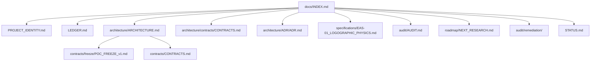

# 🗺️ Traianus Index: Master Knowledge & System Map

> **Canonical Entry Point:** Unified traceability index linking theory, production code, normative specifications, and audit tests.

---

## 📍 1. Traceability Matrix (Concept ➔ Code ➔ Test)

| Concept / Principle | Module / Script | Test / Audit | Status / Verdict |
| :--- | :--- | :--- | :--- |
| **Algebraic Kernel ($\mathbb{R}^d$, $L_2$, $\sigma^2$)** | `traianus/geometry/observables.py`<br>`traianus/governance/gate.py` | `tests/unit/test_substrate.py` | Implemented in production |
| **Representation Layer (Provider Protocol)** | `traianus/representation/` | `tests/unit/test_representation_protocol.py`<br>`tests/representation/test_representation_providers.py` | Implemented in production |
| **Append-Only SQLite WAL Persistence (`id, seq`)** | `traianus/storage.py` | `tests/unit/test_storage_hardening.py`<br>`tools/audit/traianus_invariant_verifier.py` | Implemented in production |
| **Zero-Trust Perimeter & Dual Boundary Gate** | `traianus/security/validator.py`<br>`traianus/app.py` | `tests/security/test_boundary_validator.py` | Implemented in production |
| **Bootstrap Geodesy (8D)** | `traianus/bootstrap.py`<br>`tests/fixtures/nsm_axes_8.json` | `tests/unit/test_substrate.py` | Implemented in production |
| **Corpus Variance Test (WP1 / EAS-01)** | `tools/experiments/_wp1_corpus.py` | `tools/experiments/validate_wp1_empirical.py` | **Demonstrates the Representation-Governance Coupling Problem** (Pure variance $p=0.58$ / $0.68$ ➔ Requires decoupling governance from representation) |
| **NCD Text Coupling (EAS-01 Phase 1c)** | `tools/experiments/logographic/exp_entropy_spectral.py` | `docs/specifications/EAS-01_LOGOGRAPHIC_PHYSICS.md` | **Validated Solution** ($AUC > 0.93$, defeats C4 injection) |
| **SVD Projection & Chromatic Scaling (Ulpia 5D)** | `traianus/geometry/observables.py`<br>`frontend/src/projection.ts` | `tests/unit/test_svd_projection.py` | Implemented (client-facing observational helpers) |
| **ε-Bridge Audit (non-sequential E_n)** | `tools/analyze_bridges.py` | `tests/unit/test_analyze_bridges.py` | Implemented (read-only audit tool) |

---

## 📄 2. Fractal Documentation System (`docs/`)



* **[PROJECT_IDENTITY.md](./PROJECT_IDENTITY.md):** Substrate definition, explicit boundaries (*Non-Scope*), real invariants, and the Representation-Governance Coupling Problem.
* **[LEDGER.md](./LEDGER.md):** Immutable *append-only* ledger of operational deltas ($\Delta_n$) and empirical falsifications.
* **[architecture/ARCHITECTURE.md](./architecture/ARCHITECTURE.md):** Mathematical formulation of state space $S_n = (V_n, E_n)$, SQLite DDL schema, and data flow.
* **[architecture/contracts/CONTRACTS.md](./architecture/contracts/CONTRACTS.md):** Byte-level Zero-Trust customs, Silent Denial (ADR-002), and Pydantic v2 schemas (`RawDump`, `RefinedEntity`).
* **[architecture/ADR/ADR.md](./architecture/ADR/ADR.md):** *Append-only* Architecture Decision Record log (ADR-001 to ADR-027).
* **[specifications/EAS-01_LOGOGRAPHIC_PHYSICS.md](./specifications/EAS-01_LOGOGRAPHIC_PHYSICS.md):** Normative specification of the spectral dispersion experiment, NCD coupling, and Representation-Governance Coupling Problem report.
* **[audit/AUDIT.md](./audit/AUDIT.md):** Technical audit report with remediation status.
* **[roadmap/NEXT_RESEARCH.md](./roadmap/NEXT_RESEARCH.md):** Research backlog — Ulpia Spatial Observation Framework, projection/observation theory, nuclear invariants, and future research directions.
* **[STATUS.md](./STATUS.md):** Formal classification (Implemented / Experimental / Research) + Known Limitations.

---

## 🏛️ 3. Architecture Decision Records (Featured ADRs)

* **ADR-003 / ADR-025 (Immutability & Invariants - In Production):** SQLite `(id, seq)` constraint with no `UPDATE` or `DELETE`. Validated by `tools/audit/traianus_invariant_verifier.py`.
* **ADR-002 (Silent Denial & Internal Telemetry - In Production):** Suppression of stack traces toward external callers on failure and injection of `telemetry_error` node.
* **ADR-017 (Cold-Start to Corpus Base Transition - R&D Roadmap / WP1):** Theoretical specification to progressively replace the synthetic basis $\mathbf{B}_0$ with emergent corpus axes.

---

## ⚙️ 4. Quick Audit Commands

```bash
# Hermetic test suite (offline)
pytest tests/ -m "not model"

# Invariant verifiers and TDD harness
python3 tools/audit/audit_harness.py
python3 tools/audit/traianus_invariant_verifier.py
```
