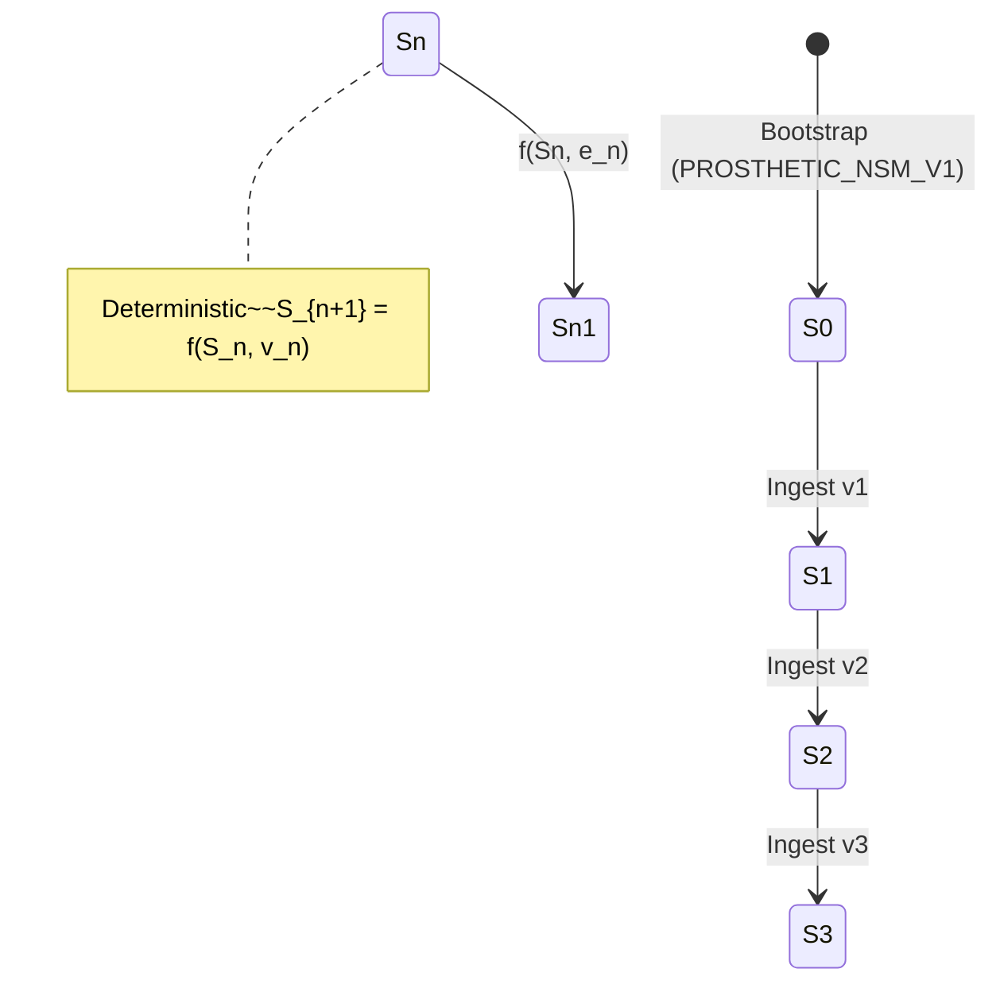
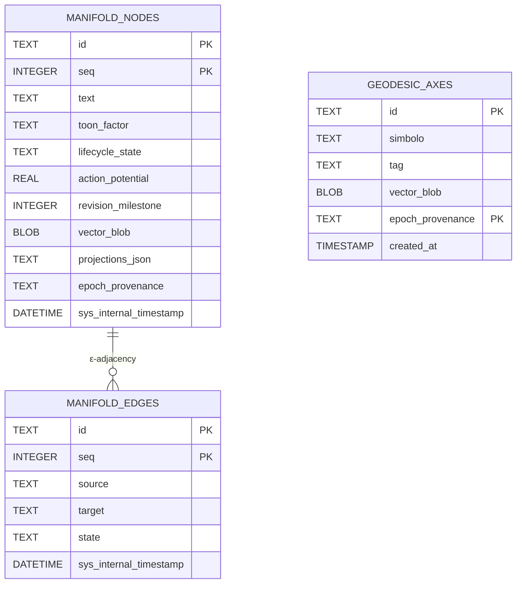
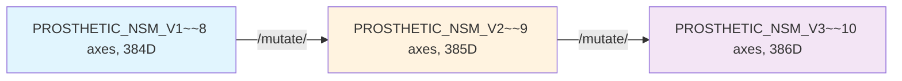

# System Architectural Formulation

## 1. Header & Scope
Purpose: This document specifies the discrete state machine, algebraic governance, variance thresholding, and transactional persistence model of **Traianus**.
Domain: Spatial state transitions ($S_n \to S_{n+1}$), $L_2$ orthogonal projection, dynamic variance circuit breaking, and SQLite WAL append-only persistence.

**Live Document Delegations:**
* For constitutional boundaries and Non-Goals, see [../PROJECT_IDENTITY.md](../PROJECT_IDENTITY.md).
* For empirical falsification records and NCD findings, see [../specifications/EAS-01_LOGOGRAPHIC_PHYSICS.md](../specifications/EAS-01_LOGOGRAPHIC_PHYSICS.md) and [../LEDGER.md](../LEDGER.md).
* For architectural decision records, see [./ADR/ADR.md](./ADR/ADR.md).
* For Pydantic data schemas and Zero-Trust validation, see [./contracts/CONTRACTS.md](./contracts/CONTRACTS.md).

---

## 2. Architectural Invariants

* **Representation Invariance:** Traianus never modifies input vector coordinates emitted by external providers. The control plane exclusively governs lifecycle states, spatial adjacencies, and historical sequences.
* **Invariante Append-Only (`PRIMARY KEY (id, seq)`):** State mutations are written strictly as incremental append-only events. Operating `UPDATE` or `DELETE` queries on historical records is forbidden.
* **Invariante C1 (Self-Projection Exclusion):** Dynamic variance calibration ($\theta_{\text{dyn}}$) explicitly excludes diagonal auto-projections ($i \neq j$) to prevent threshold inflation caused by trivial self-similarity.
* **Observation Isolation:** Read-only projections $O_n = P_\theta(S_n)$ operate over state $S_n$. The substrate contains zero 2D/3D rendering code or layout logic.

---

## 3. Mathematical Formulation of System State ($S_n$)

Traianus operates as a discrete, deterministic state machine. At ordinal sequence step $n$ ($n \in \mathbb{N}$), the active spatial state is defined as:

$$S_n = (V_n, E_n)$$

Where:
* $V_n \subset \mathbb{R}^d$: Finite set of $L_2$-normalized coordinate vectors (vertices).
* $E_n \subseteq V_n \times V_n$: Deterministic adjacency edges formed strictly where $d(\mathbf{v}_i, \mathbf{v}_j) \le \epsilon$.
* *(Higher-order simplicial complexes $K_n$ are roadmap I+D scope under WP2).*

The active geodetic basis $\mathbf{B}_n \in \mathbb{R}^{d \times k}$ is maintained by the Spatial Control Plane to calculate projections without mutating $S_n$.

### 3.1 Deterministic State Transition
Given an incoming payload $e_n$ containing a coordinate vector $\mathbf{v} \in \mathbb{R}^d$, the state transition follows:

$$S_{n+1} = f(S_n, e_n)$$

Given an identical initial state $S_0$ and sequence $E = \{e_0, e_1, \dots, e_k\}$, $f$ yields the exact same state $S_{k+1}$ **without stochastic variation**. Sequence ordinal $n$ is completely decoupled from wall-clock time.



---

## 4. Subsystem & Data Flow

```mermaid
flowchart TD
    subgraph ZT["Zero-Trust Ingress"]
        A[Raw text/plain] --> B[UTF-8 strict + null-byte scan]
        B --> C[Idempotency Key check]
    end
    
    subgraph GG["Geometry & Governance"]
        C --> D[Provider.encode → L2 norm]
        D --> E[Project onto B₀ → σ²]
        E --> F[C1 Gate: σ² ≥ θ_dyn ∧ EthicalKey]
    end
    
    subgraph TP["Transactional Persistence"]
        F --> G[INSERT manifold_nodes (id, seq++)]
        G --> H[WAL commit]
    end
    
    subgraph OC["Observation Contract"]
        H --> I[/nodos GET]
        H --> J[/relations GET → rebuild E_n]
        H --> K[/telemetry GET]
    end
```

---

## 5. Persistence Schema

The canonical relational tables in `traianus/storage.py` maintaining entity state persistence:



| Table | Field | Type | Purpose |
| :--- | :--- | :--- | :--- |
| `manifold_nodes` | `id` | TEXT | Entity identifier (`NODE_{ingestion_id}`). |
| | `seq` | INTEGER | Monotonically increasing revision sequence per `id` (current state = `MAX(seq)`). |
| | `lifecycle_state` | TEXT | Lifecycle enum: `pending_approval`, `incubating`, `consolidated`, or `telemetry_error`. |
| | `vector_blob` | BLOB | Binary float array storing $L_2$-normalized vector $\mathbf{v} \in \mathbb{R}^d$. |
| | `projections_json` | TEXT | Full multi-axis projection spectrum (JSON). |
| `manifold_edges` | `id` | TEXT | Edge identifier (`auto-edge-{src}-{tgt}` or `edge-{src}-{tgt}`). |
| | `source` | TEXT | Source node id. |
| | `target` | TEXT | Target node id. |
| | `state` | TEXT | Edge state: `auto`, `removed`, or manual state. |
| `geodesic_axes` | `id` | TEXT | Axis identifier (`AXIS_1`..`AXIS_n`). |
| | `simbolo` | TEXT | Display symbol (▲, ■, ●, etc.). |
| | `tag` | TEXT | Semantic tag (e.g., `_SOMETHING`, `_DO`). |
| | `vector_blob` | BLOB | Axis vector in active epoch dimension. |
| | `epoch_provenance` | TEXT | Epoch label (`PROSTHETIC_NSM_V1`, `V2`, ...). |

---

## 6. Execution Guarantees

| Core Claim | Execution Mechanism | Boundary |
| :--- | :--- | :--- |
| Deterministic Transition | Pure operators in `traianus/geometry/observables.py` and gate C1 in `traianus/governance/gate.py`. | Zero stochastic token completion in the control plane. |
| Append-Only Integrity | SQLite composite primary key `(id, seq)`. | Operations `UPDATE` and `DELETE` are forbidden. |
| Hermetic Execution | Local SQLite WAL transactions. | Operates fully offline with zero cloud runtime network dependencies. |

## 7. Epoch Evolution (Logographic Genesis)

The geodetic basis evolves via immutable epoch-append. Each `/mutate/{symbol}` creates a new epoch with re-padded prior axes + one canonical axis:



* **V1 (Bootstrap)**: 8 NSM primitives, fixed offline scaffold
* **V2+ (Logographic Genesis)**: Each mutation adds 1 dimension + 1 canonical axis; prior epochs remain immutable
* **Cross-epoch comparisons prohibited**: Active epoch = most recent `created_at` in `geodesic_axes`
